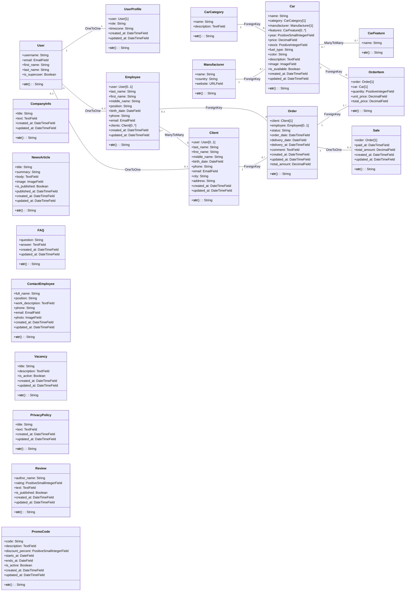

# Диаграмма моделей CarShowroom

## Основные связи

- `User` и `UserProfile` связаны через `OneToOneField`.
- `Client` и `Employee` могут быть связаны с `User` через `OneToOneField`.
- `Employee` и `Client` связаны через `ManyToManyField`.
- `Car` связан с `Manufacturer` и `CarCategory` через `ForeignKey`.
- `Car` и `CarFeature` связаны через `ManyToManyField`.
- `Order` связан с `Client` и `Employee` через `ForeignKey`.
- `OrderItem` связывает `Order` и `Car`.
- `Sale` связан с `Order` через `OneToOneField`.
